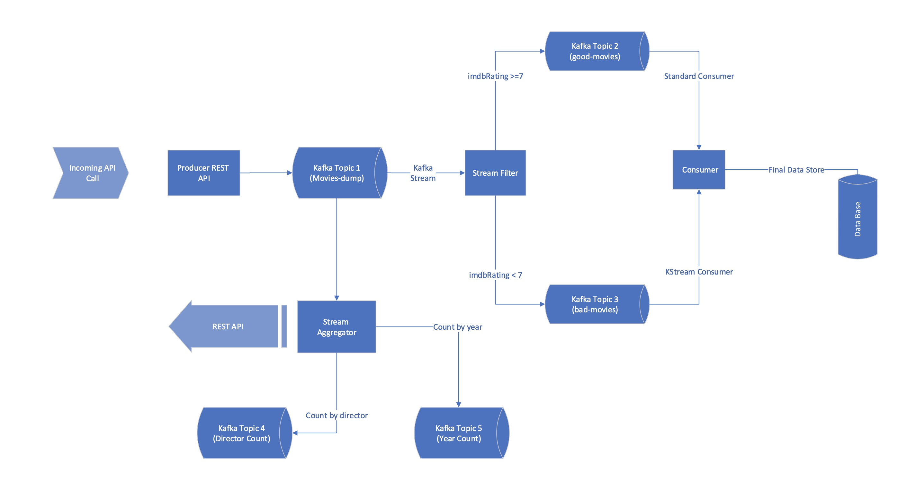

# Exploring Kafka Streams

Kafka Streams is one of the ways streaming (flowing events) can be worked upon right away to get insights. Some of the operating that are possible:  
 - Filtering
 - Grouping
 - Aggregating
 - Joining

Kafka Streams is a Java built API. Both Streams & KSQL DB can achieve the same operation - the fundamental difference is that KSQL is an additonal Clustered Infrastructure provisioning where the SQL like queries will run against the topic and perform the desired operation.  Whilst, Streams is a Code level deployment (plugged in with Kafka-Stream Libraries).

<!--- ## Potential Enterprise Use-cases 

    Instead of persisting huge data to databases & querying them for real time use cases (which are becoming complicated nowadays, since ingesting sources (producers) keep increasing, as well the existing TerraBytes of Data can (post a challenge) pose a threat tos performance).
    
    Here comes our Kafka-Streams, where we can start applying filtering logic and take it to next level with state storage. These state storage can be leveraged upon for real-time data (for queries), as well the data can be injected to static database BigData Platform Solutions - where ML / AI / DataScience can be applied. 

    The "REAL-TIME" is the key concept in Kafka-Streams. The world moving so much ahead, where CONSUMERS are not much concerned about yesterday's data. They somehow want real-time data to be processed based on yesterday's performance / outcome.

    Real-Time Spam Filtering, Content Violation in Social Media (where a post data can be serialiazed and stored in a topic - which can be filtered by a AI service, can trigger an Alarm if it's beyond a particular level), Fraudlant Transaction - where more data processing from pre real time. One real use case that I have encountered, is business are keen to know how to promote their products - so during campaigns, they tend to add the url UTM pararmeters, and based on the HIT's a kafka stream can be utilized to observe the trends on how user's are getting attracted towards  
    

    Lemme give a more realistic example - have you ever tried to create a duplicate account with just one of (phone number / address the same / credit card number) ? - Most of the Systems do block this kind of behaviour. 
    
>> Events are more valuable to companies than the end state. 
>> Ex: I purchased a coffee at Starbucks, purchased an iPhone 13. Now for a financial institute those individual purchases are events, and the state is mainly the balance that's left after purchase. If they are smart enough, they can process this and start giving me ad's that can lure me to purchase more :) 


    In contrast, if you think why can't a traditional DataBase can't handle the volume - yes, it can handle. But comes with huge costs - for more Enterprise & mission critical applications performance and replication like Oracle RAC + Golden Gate is more reliable. Kafka can do it with the power of distributed computing - that is more resilient and can scale with ease and at a cheaper cost (pennies compared to database). Also, in database the concept is totally different - we don't have much flexiblity to store the events. it's more about the end-state of the transaction. And database is more optimized for query performance - with b-trees powering in backend. So, essentially what we need to understand it that Kafka and DataBases are complementary tools that should be used to solve more complex problems in "REAL-TIME" :) 


  Some interesting thoughts, the Concept of RealTime is more of a myth, where it applied only to the 

  TIBCO offers the most realtime for Enterprise applications - but comes with a huge cost, and companies are trying to move away replacing with Traditional MQ's - like IBM WebSphere MQ / Rabbit MQ, as well avoiding vendor locks as much as possible.


### Kafka High Level Use Cases
  The Use cases of Kafka are really interesting from an Enterprise StandPoint. If a particular data source has to be shared between multiple applications - the more traditional approach is SFTP / FTP or IBM Connect-Direct (aka NDM) or MQ transfer, where multiple MQ's channel's need to be created. 

  Kafka simplifies all of these with a simple concept of group-id. It tracks the group id pointers and ensures that data can be consumed at different rate by different group-id members. IF you look at the bigger picture a single stream of data can sufficiently be consumed by 4-5 applications, without having massice impact on the performance.  (NOTE: adding more consumer groups will definitely add to network congestions). Additionally, the massive feature kafka-schema registry helps application teams (be it producer / consumer) to have the data validated before producing / utilizing. This helps to reduce the PROD issues / MIM's during HOT run-times. Whist, some debate this might be a redundant addon - because teams coordinate well before any production release, I see this a critical feature since, I have personally been on a PROD call with a producer team made an issue in the data format and we (as a consumer) - didn't validate it properly, and had issues while persisting to database
  

--->


---

## Application Architecure:   




Movie data will be POSTED with Rest-API, that are inserted into movies-dump Topic - ***producer-api*** service will be responsible for this action. 

This topic will be streamed & filtered by ***stream-filter*** service. This service will filter the movies based on the IMDB rating ( good movie if rating >=7; else bad movie) 

Finally, the ***stream-consumer*** service will print the messages in both good-movies & bad-movies topic. One I have used *Standard Kafka Consumer Client* library, while for another I have again used *KStreams* to stream the data. This is just to have a variation 

### Add-On services

The ***stream-aggregator*** service does aggregate the data from movies-dump topic - based on the director name, and aggregate operation is count(), as well streams this data back to director-counnt topic. 

This data is being queried back from ***stream-aggregator*** service with a REST endpoint, where the director name is searched (as KEY) and the response is count of movies. 


> For each of the service, I have attached reference properties file (sample). I have used Confluent Cloud's infrastructure for this demo, so might be slightly advanced (in terms of security properties).

---

## NOTE
 - During Stream Queries - i have observed that the below Error ``` because the stream thread is STARTING, not RUNNING```, and found that the it takes few more seconds for the stream to start properly. So, this is something that needs handling - like a State Check (health check)
   - To Counter this during every stream query, added this ```  if ( streams.state().toString().equalsIgnoreCase("RUNNING") ) ``` validation to ensure an active state-stream is queried.
 - Also, during the streamed query many factors needed to be considered, like 
   - Querying local state stores 
   - discover and query other instances of the same app (ex: containers / ec2 instances ); because in multi-instance mode one instance is assigned a partition

## Inserting JSON Data

The data-dump i have taken contains around 47K movies data. for quick testing I used the JQ filtering to filter out based on year & IMDB Rating. 

``` shell
jq '.[] | select(.imdbRating>6.8 and .imdbRating < 7.1 and .year > 2000 and .year < 2003)' movies_dump.json > striped_data.json
```
